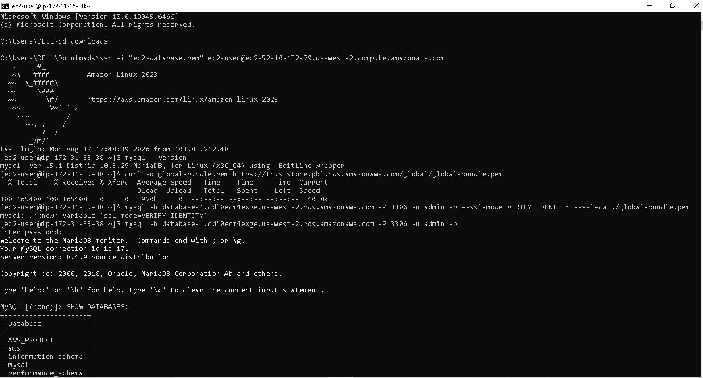
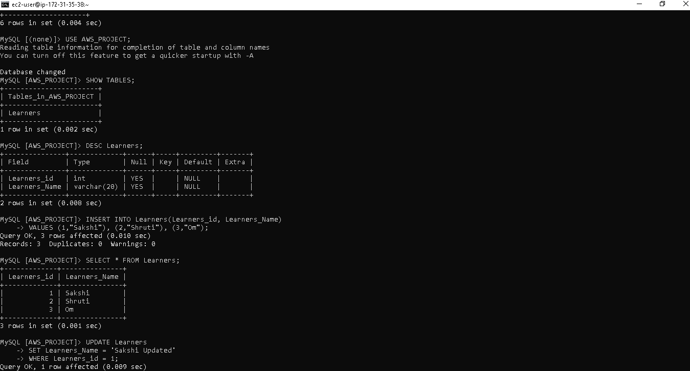
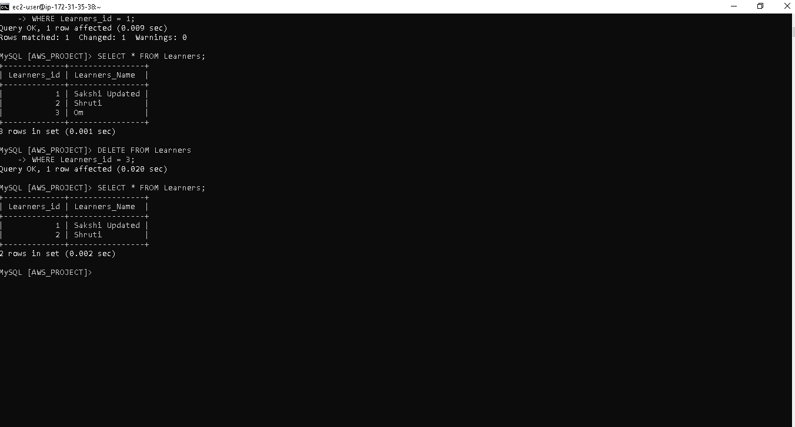

# 🗄️ Database Migration to Amazon RDS

## 📌 Project Overview

This project demonstrates the migration of a **self-managed MySQL database environment to Amazon RDS**. An Amazon EC2 instance is used as the application environment and securely connects to the RDS MySQL database.

The project also verifies the migration by creating a database, managing a table, and performing **CRUD operations**.

---

## 🏗️ Architecture

```text
                 AWS Cloud
                    │
             ┌──────▼──────┐
             │     EC2     │
             │ Application │
             └──────┬──────┘
                    │
             MySQL : 3306
                    │
             ┌──────▼──────┐
             │     RDS     │
             │    MySQL    │
             └──────┬──────┘
                    │
             ┌──────▼──────┐
             │ AWS_PROJECT │
             │  Learners   │
             └─────────────┘
```
---

## ☁️ AWS Services Used

* **Amazon RDS** – Managed MySQL database
* **Amazon EC2** – Application and database client environment
* **Amazon VPC** – Provides network connectivity
* **Security Groups** – Controls inbound database access
---
## ⚙️ Implementation Steps

### 1. Create RDS MySQL Instance

A MySQL database was created using **Amazon RDS** and configured within the AWS VPC.

### 2. Configure Security

The RDS Security Group was configured to allow **MySQL traffic on port 3306** from the EC2 environment.

The database was kept private and access was restricted through the Security Group.

### 3. Connect EC2 to RDS

The MySQL client installed on the EC2 instance was used to connect to the RDS database.

```bash
mysql -h <RDS-ENDPOINT> -P 3306 -u admin -p
```

After successful authentication, the `AWS_PROJECT` database was accessed.

### 4. Database Operations

A `Learners` table was created and populated with sample records.

```sql
USE AWS_PROJECT;

SELECT * FROM Learners;
```
---

## 🔄 CRUD Operations

The following operations were performed successfully:

| Operation | SQL Command | Status |
| --------- | ----------- | ------ |
| Create    | `INSERT`    | ✅      |
| Read      | `SELECT`    | ✅      |
| Update    | `UPDATE`    | ✅      |
| Delete    | `DELETE`    | ✅      |

Example:

```sql
-- Create
INSERT INTO Learners (Learners_id, Learners_Name)
VALUES (1, 'Sakshi');

-- Read
SELECT * FROM Learners;

-- Update
UPDATE Learners
SET Learners_Name = 'Sakshi Updated'
WHERE Learners_id = 1;

-- Delete
DELETE FROM Learners
WHERE Learners_id = 1;
```

---

## ✅ Result

The **EC2 instance successfully connected to the Amazon RDS MySQL database**. Database connectivity was verified and CRUD operations were performed successfully on the RDS-hosted database.

This demonstrates how Amazon RDS can be used as a **managed, scalable, and secure alternative to running a MySQL database directly on an EC2 instance**.

---

## 📸 Screenshots

### EC2 to RDS Connection



### Create and Insert Operations



### Update and Delete Operations


---
## 🎯 Key Learning Outcomes

* Created and configured a **MySQL RDS instance**
* Established secure **EC2-to-RDS connectivity**
* Configured Security Groups for database access
* Performed MySQL **CRUD operations**
* Understood the basics of managed database deployment on AWS

## 🛠️ Technologies

**AWS RDS | AWS EC2 | MySQL | VPC | Security Groups | Linux**
